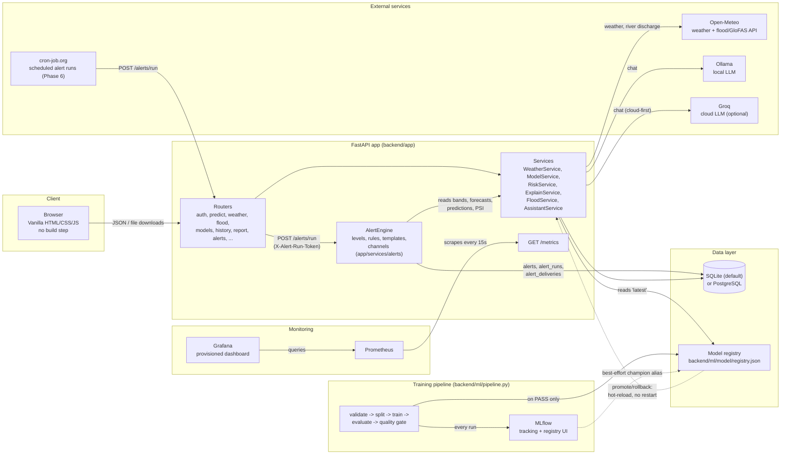
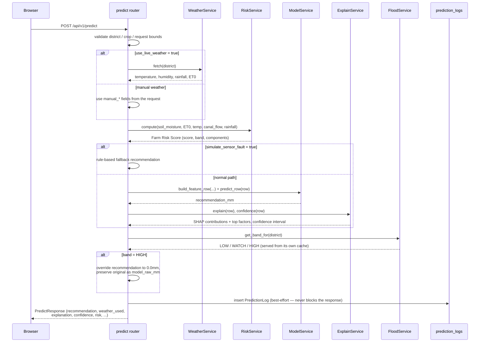
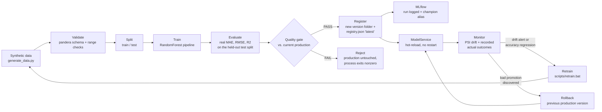
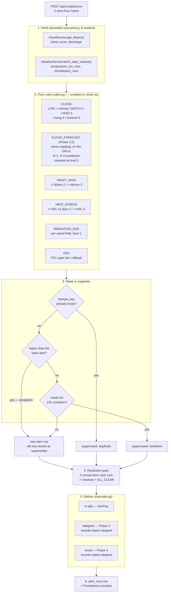

# Architecture

This document covers four views of the system: the overall component
topology, the request flow through the core `POST /predict` endpoint, the
MLOps lifecycle loop that trains, gates, and monitors the model, and the
five-level alert engine that turns those signals into farmer-facing
warnings. See
[README.md](README.md) for setup and [PROGRESS.md](PROGRESS.md) for the
full phase-by-phase build history behind these decisions.

## 1. System components

Every arrow into `Services` from an external provider (Open-Meteo, Ollama,
Groq) degrades independently on failure — a down weather API never breaks
the assistant, a down LLM never breaks a prediction. This per-section
failure tolerance is a recurring pattern across the codebase (see
`MapOverviewService`, `FloodService`, `AssistantService`).

`ModelService` reads the versioned artifact folder + `registry.json`
directly — **not** through MLflow — so the app serves predictions correctly
even with the MLflow server stopped. MLflow adds tracking, a run-comparison
UI, and a best-effort `champion` model-registry alias on top of that, but is
never on the critical path for serving a request.

## 2. Request flow: `POST /predict`

Two things are worth calling out: the flood check reads `FloodService`'s
own in-memory cache rather than making a fresh network call, so it never
adds latency to `/predict`; and writing to `prediction_logs` is wrapped in
its own try/except — a logging failure degrades gracefully instead of
turning a successful prediction into a 500.

## 3. MLOps lifecycle

The quality gate (`F`) is the one gate that matters: a candidate that
performs worse than the currently-served production model (beyond a small
configurable tolerance) or fails an absolute floor/ceiling never reaches
`registry.json` — there is no path from a failed gate to a served model.
Promote and rollback (human-triggered, via the Models page or API) go
through the same gate at reduced strictness (absolute ceilings only, since
a human is making an explicit choice) and the same hot-reload path as an
automated promotion.

## 4. Alert engine (LEHAR Phase 2)

One evaluation run over every district, from upstream measurement to a
delivered, auditable alert. See [docs/ALERT_LEVELS.md](docs/ALERT_LEVELS.md)
for the levels, the thresholds and the farmer-facing actions.

Four properties are worth calling out, because they are the reason the
engine is shaped this way.

**An alert row means something is happening.** Level 1 (white) is the calm
baseline and is *computed*, not stored: `GET /api/v1/alerts/active` returns
every district, filling in level 1 for any that has no active alert. A LOW
flood band therefore raises nothing, and a calm 107-district sweep stores
zero rows instead of one per district per rule. The only level-1 rows are
IRRIGATION_DUE (one per saved field per day — a field is narrower than a
district, so its dedupe key carries a `field:<id>` subject) and ALL_CLEAR,
which is born resolved.

**The rules are pure.** `rules.py` takes plain numbers and returns a level.
No I/O, no clock, no database, no model, no LLM — `engine.py` does all the
fetching and hands the values over. That is what makes an alert auditable
(CLAUDE.md rule 10): a reader traces input to threshold to level without
leaving one file, and the same inputs always produce the same alert. Every
alert row stores the values it fired on, the thresholds it compared them
against and the source timestamps, so the decision can be re-derived years
later even after the thresholds have changed.

**Dedupe is enforced by the database, not by the engine.** `dedupe_key`
(`district + type + level + day`) carries a `UNIQUE` index, so two
concurrent runs cannot both raise the same alert. Escalation is the one
thing that always wins: a higher level creates a new row and ignores the
cooldown entirely, because a farmer must never wait out a cooldown to be
told things got worse. Levels are never edited in place — the superseded
alert is closed, so the history of what the farmer was actually told
survives.

**Everything degrades per district.** A district whose flood or weather
fetch fails is skipped with a warning and the other 106 continue, the same
per-section failure tolerance `MapOverviewService` and `FloodService`
already have. A rule with no usable input declines to fire rather than
guessing: no model prediction means no IRRIGATION_DUE alert,
`insufficient_data` from drift means no OPS alert, and a flood lead-time
model that cannot answer means no FLOOD_FORECAST alert — never an invented
number (CLAUDE.md rule 4).

**Prediction is a separate claim from observation** *(LEHAR Phase 2.5)*.
FLOOD_FORECAST is its own alert type rather than a flag on FLOOD, because
"the river is high" and "the river is expected to rise" are different
statements with different evidence behind them. Separate types mean the two
dedupe, escalate and resolve independently, and a district can hold both at
once. The forecast's level is computed by delegating to the observed rule's
own `evaluate_flood()` with the model's predicted discharge substituted in —
one implementation of "what level is this", so the two can never drift apart
— and is then clamped to level 3, keeping a three-day-ahead prediction from
a small research model out of the level-4/5 "evacuate now" territory that
observed discharge alone is allowed to reach. The model is trained with
PyTorch but served as ONNX through onnxruntime, so the 512 MB API process
never imports a training framework (CLAUDE.md rule 11). See
[docs/FLOOD_DL.md](docs/FLOOD_DL.md).

## Design decisions

| Decision | Why |
|---|---|
| Vanilla JS frontend, no framework or build step | CLAUDE.md rule 7 — the whole app runs offline with zero build tooling; every third-party asset (Chart.js, Leaflet, fonts) is vendored locally rather than pulled from a CDN |
| Dual model registry (`registry.json` + MLflow) | `registry.json` is the source of truth `ModelService` actually loads from, so serving works with MLflow stopped; MLflow adds tracking, a run-comparison UI, and a best-effort registry alias on top, never on the serving critical path |
| Hybrid LLM: cloud-first with automatic local fallback | Free-tier cloud speed/quality when a key is configured and reachable, but the assistant never goes fully offline as long as Ollama is installed — no single point of failure, and `LLM_PROVIDER=none`/`ollama`/`cloud` are still available for an explicit, non-hybrid choice |
| Local-first; Docker Compose entirely optional | CLAUDE.md rule 5 — SQLite + no Docker is the zero-setup default for every feature except the optional Postgres/MLflow/Prometheus/Grafana services, which layer on without changing any app code |
| Alert rules are pure functions, separate from the engine that runs them | CLAUDE.md rule 10 — an alert has to be traceable from input to output and reproducible from the same inputs. Keeping thresholds in `rules.py` (no I/O, no clock, no model) means every level can be tested at both sides of its boundary without a database, and the stored payload is enough to re-derive the decision later |
| Level 1 computed as the calm default rather than stored per district | An alert row should mean something is happening. Storing "the river is normal" for 107 districts every day would bury the alerts that matter and make the alerts table mostly noise; deriving the calm state in `GET /alerts/active` gives the map a complete, gapless view for free, and keeps a real level-1 IRRIGATION_DUE advisory visible against it via `source` |
| Alert dedupe enforced by a `UNIQUE` index, not just an engine check | The engine is designed to be run by an external scheduler (Phase 6's cron-job.org) that can fire twice, overlap, or retry. A code-level check would let two concurrent runs both raise the same alert; the database constraint cannot |
| Alert messages are fixed bilingual string templates, never model-generated | CLAUDE.md rule 10 — an LLM may help a farmer *read* an alert, but a warning whose wording varies run to run is neither auditable nor trustworthy. The mandated research-advisory disclaimer is appended by the template layer so it cannot be forgotten on any surface (rule 12) |
| OPS breadcrumbs in a JSON-lines file rather than a table | The two events that matter most — a quality-gate FAIL and a rollback — are produced by *different processes*: the training pipeline runs standalone with no API database session. A small file under the data directory is reachable from both and needs no migration for what is a diagnostic breadcrumb |
| Per-section failure tolerance in aggregating services | `MapOverviewService`, `FloodService`, and `AssistantService` all treat each district/section as independently best-effort, so one upstream failure (a single district's weather call, a down LLM) degrades only that piece instead of the whole response |
